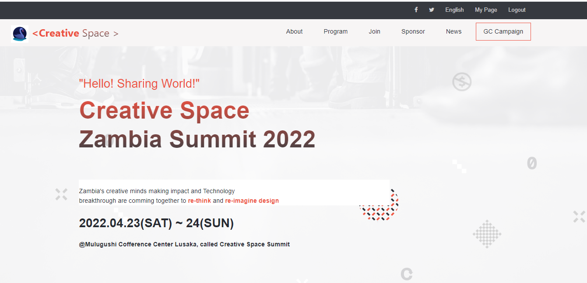

# Creative Space

> A space for the craatives to empower and build innovative solutions together .
- Zambia's creative minds making impact and Technology
  breakthrough are comming together to re-think and re-imagine design.

## Built With

- HTML, CSS & JAVASCRIPT
- BOOTSTRAP , SASS
- LOCAL STORAGE API
- LINTERS

## Live Demo (available)
### New Updates coming.
- [Live Demo Link](https://kinginthenorthcodez.github.io/capstone-project-1/)
- [Video Demo](https://www.loom.com/share/1ee6356a13dd4db2a08812330f85f195)

## Getting Started

### To get a local copy up and running follow these simple example steps.
  - Clone the Repo 
  - And Run in browser and your favorite editor

### Prerequisites

### Setup
- check on getting started
### Install
- Does  not require installations
- Runs on any morden browser
### Usage
- Web browser Application
### Run tests
- Linters for development 
### Deployment
- Deployable on any host of choosing 
- You can find live link of this page above

## Authors

👤 **Author1**

- GitHub: [@kinginthenorthcodez](https://github.com/kinginthenorthcodez)
- Twitter: [@kinthenorthcode](https://twitter.com/kinthenorthcode)

## 🤝 Contributing

Contributions, issues, and feature requests are welcome!

Feel free to check the [issues page](../../issues/).

## Show your support

Give a ⭐️ if you like this project!

## Acknowledgments

- Thanks to my collaborators
- Thanks to Stack overflow and open source community
- Original design idea by [Cindy Shin in Behance](https://www.behance.net/adagio07).

## 📝 License

This project is [MIT](./MIT.md) licensed.
